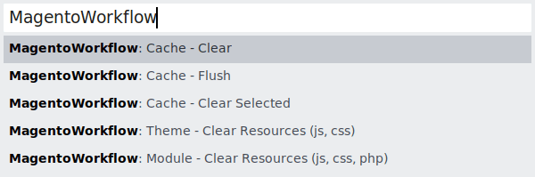

# MagentoWorkflow

Magento 2 workflow without the hassle. Do the work with enabled cache to gain
maximum performance! Forget about cache refreshes, php errors because of
updated constructor arguments, and outdated static content!
MagentoWorkflow plugin automatically cleanup appropriate generated files and
triggers cache invalidation.

## Installation

> Windows is not supported

 1. Run “Package Control: Add Repository” command and add
    `https://github.com/vovayatsyuk/sublime-magento-workflow.git` link.
 2. Run “Package Control: Install Package” command, find and install
    `sublime-magento-workflow` plugin.

## How it Works

When you save the file, MagentoWorkflow automatically cleanup appropriate
generated files.

A message will be shown in the status bar:

## Commands

## Snippets

Previous version of this plugin had some useful snippets. Now, they've been
moved to [MagicTemplates](https://github.com/vovayatsyuk/sublime-magic-templates)
plugin.
